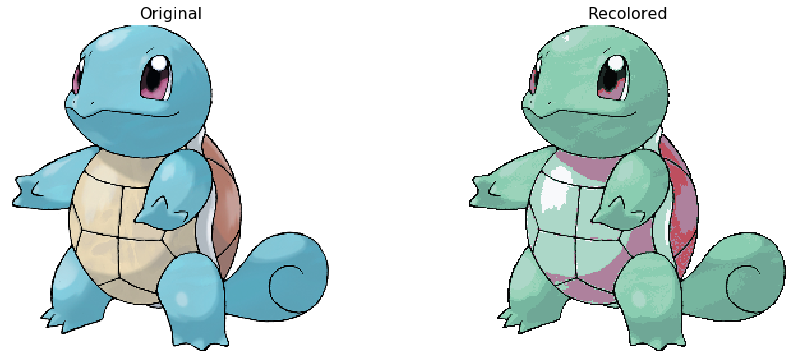

# Pokemon-Coloring-Book
### Recolor pokemon using k-means clustering

Images from:

* [Kaggle data set](https://www.kaggle.com/kvpratama/pokemon-images-dataset) by kvpratama

* [Serebii Pokedex](https://www.serebii.net/pokedex-sm/)

Code to make scatter plot of colors from [Python Data Science Handbook](https://jakevdp.github.io/PythonDataScienceHandbook/) by Jake VanderPlas

Blog post about k-means clustering: [Blog](https://medium.com/@yee.brian21/pok%C3%A9mon-coloring-book-6ff5006c57c7)
